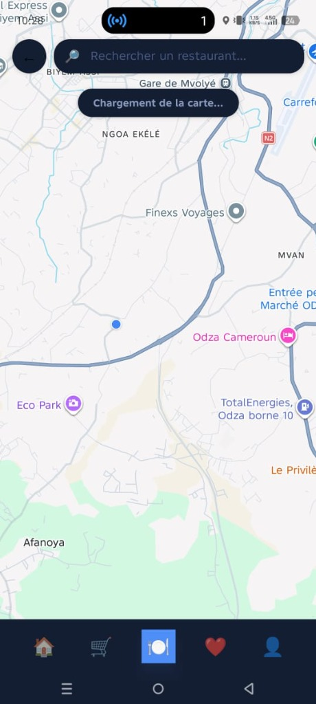
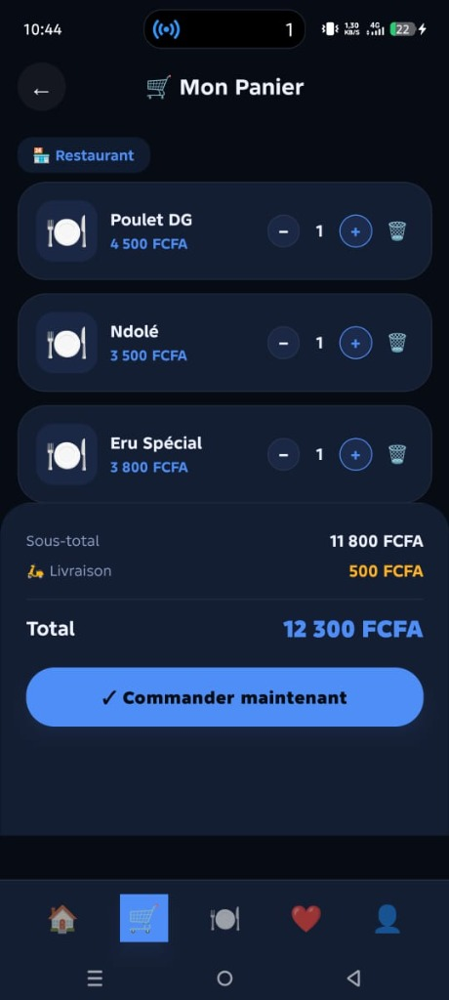
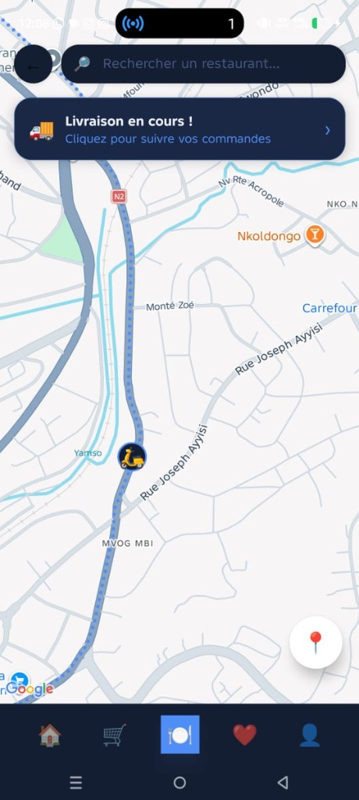
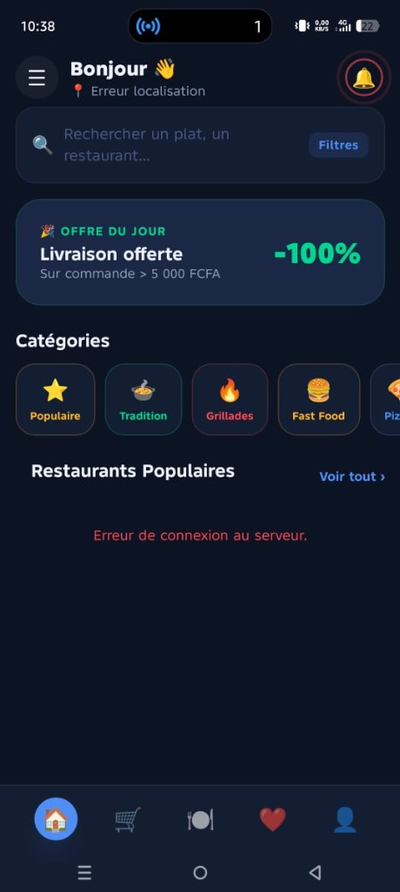
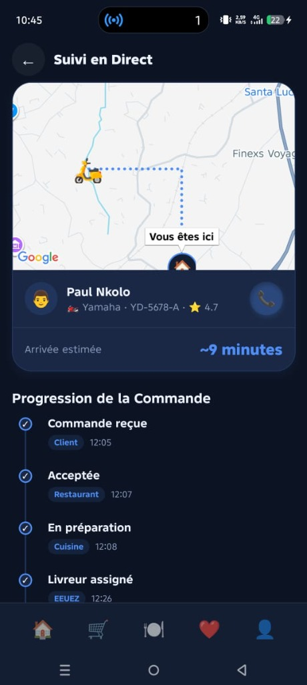
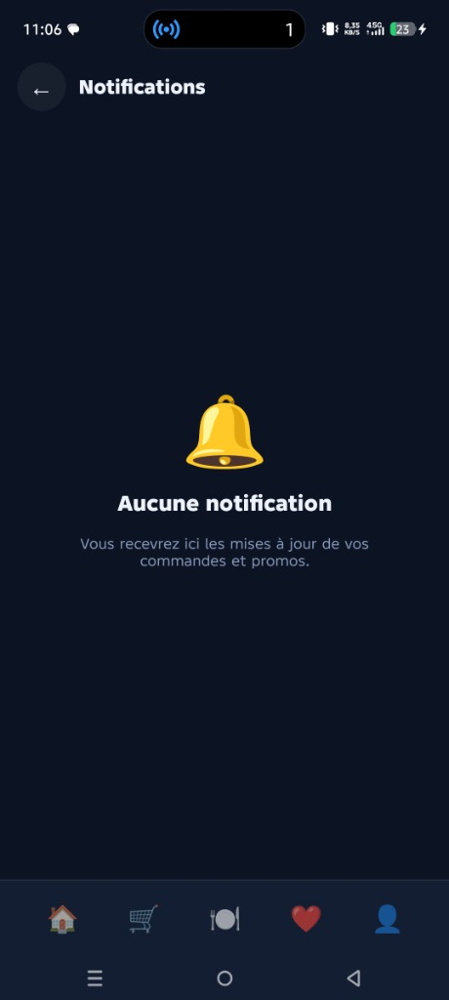
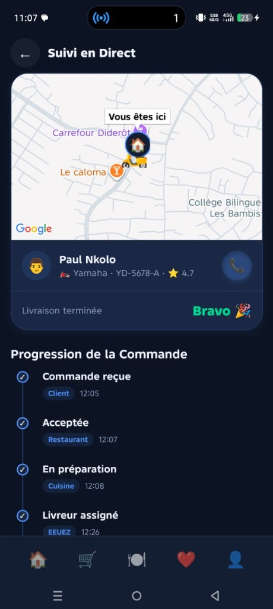

# 🛵 EEUEZ Menu - Application de Commande & Livraison

Bienvenue sur le dépôt de **EEUEZ Menu**, une plateforme complète de restauration en ligne qui inclut la prise de commande, la gestion des paniers, l'exploration des restaurants et un système avancé de **suivi de livraison GPS en temps réel**.

L'application a été repensée pour offrir une expérience utilisateur haut de gamme, fluide et avec des animations immersives, que ce soit du point de vue du client, du restaurant ou du livreur.

---

## 📸 Aperçu de l'Interface

Voici une galerie présentant l'évolution et les écrans clés de notre application :

### 1️⃣ Interface Principale (Client)
L'écran d'accueil permet d'explorer les plats, de filtrer par catégories et de naviguer avec une barre de recherche fluide.

<div style="display:flex; flex-direction:row; gap:10px;">
  
  
  
</div>

### 2️⃣ Panier & Commande
Le système de panier a été corrigé pour permettre un scroll fluide et une validation de commande sans encombre. L'interface affiche le total, les frais de livraison et permet de valider avec une micro-animation de confirmation.

<div style="display:flex; flex-direction:row; gap:10px;">
  
  
</div>

### 3️⃣ Suivi de Livraison ("Style GTA") & Empty States
Nous avons développé un système de carte dynamique unique. Si le client n'a pas de commande, il voit un "Empty State" élégant. Lorsqu'une commande est en cours, le livreur est suivi sur la carte.

<div style="display:flex; flex-direction:row; gap:10px;">
  
  
</div>

---

## 🛠️ Ce que nous avons manipulé & implémenté

### 1. Refonte de l'Interface Client (Expo / React Native)
* **Glassmorphism & Micro-animations** : Refonte visuelle utilisant `react-native-reanimated` et l'API `Animated` de base pour générer des rebonds (boutons), des ondes de choc (pulse anim), et un effet de flou visuel.
* **Scroll & Layouts** : Correction des bugs de défilement (ScrollViews bloquées, paniers inaccessibles en bas de page).
* **Filtres Dynamiques** : Catégories interactives avec sélection visuelle et filtres animés.

### 2. Algorithme de Suivi de Livraison (Simulation GPS Avancée)
Nous avons créé un moteur de simulation complet dans `AppContext.tsx` pour l'interface de Suivi (`suivi.tsx`) et la Carte exploratoire (`explore.tsx`) :
* **Appel OSRM (Open Source Routing Machine)** : Tracé des routes réelles sur la carte via l'API OSRM.
* **Comportement Adaptatif (Effet GTA)** : 
  * Le système génère parfois un "hors-piste" pour simuler une déviation inattendue du livreur (ex: travaux, trafic).
  * La ligne de chemin bleue (GPS) reste **fixe** pendant 2.5 secondes pendant que le livreur s'en écarte (latence visuelle réaliste).
  * Le système détecte l'écart grâce à une **formule mathématique de Haversine**.
  * Au bout du délai, un **nouveau calcul** du plus court chemin OSRM est fait à partir de la position *actuelle* du livreur vers la destination.
  * L'ancien chemin disparaît et la nouvelle ligne "snappe" organiquement sans aucune téléportation du livreur.

### 3. Connexion Backend (Django / Spring Boot)
* Mise en place des appels asynchrones vers le serveur.
* Adressage IP dynamique pour permettre à l'application tournant sur un téléphone physique (via Expo Go) de communiquer avec le backend local (`192.168.1.187:8088`).

---

## ⚙️ Technologies Utilisées

* **Front-end** : React Native, Expo Router, React Native Maps
* **Styling** : StyleSheet (Custom design system avec effets *glow*)
* **Back-end** : API REST (Django / Spring Boot)
* **Routing GPS** : API OSRM (Project-OSRM)

## 🚀 Comment lancer le projet ?

### Front-end (Application Mobile)
1. Assurez-vous d'avoir Node.js installé.
2. Ouvrez un terminal :
```bash
cd eeuez-expo-ui
npm install
npm run start
```
3. Scannez le QR Code avec **Expo Go** sur votre smartphone.

### Back-end (API)
Lancez votre serveur local sur le port 8088 pour que l'app mobile puisse interagir avec la base de données.

---
*Projet propulsé et structuré avec amour et du code robuste. ❤️*
